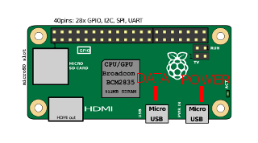

### First Steps


The first thing you'll want to do is connect to your Raspberry Pi Zero to set it up and do some configuration.  

#### Plugging it in
To begin, connect your Pi by plugging it into the micro USB marked DATA on the diagram below.  This USB plug will not only power but allow us to transfer data between your computer and the Pi.  The USB marked POWER is to power the device only.



After you have plugged in the device, you should see a flickering green light on the Pi.  The Pi Zero is doing its first run initialization at this point, so you should give it a few minutes before carrying on.  One thing to note however is that subsequent boots will not take as long.

#### Connecting to the Raspberry Pi
Connecting to the Raspberry Pi requires the use of a program called `ssh`.  `ssh` is a program that allows you to connect to remote and, and this case, very much local systems, and administrate them.  Usually you connect via IP address or domain/hostname.  In the case of our raspberry pis, we will be using hostname through the magic of service discovery.  Most modern computers run automatic service discovery usually called Bonjour or Avahi.  I won't go into too much details but it will essentially discover the Pi Zero and use its hostname to give the computer a local only designation for which we can connect to it by.  In this case, this will be `raspberrypi.local` which is essentially in format of `<pi hostname>.local`  It is important to know this as later you will be changing your Raspberry Pis hostname so subsequent connections will no longer be able to use the default of `raspberrypi.local`.

To connect, run `ssh pi@raspberrypi.local`.  This command will attempt to make an SSH connection to the Pi Zero as the user `pi`.  This user also has a default password of `raspberry` so you can enter that in when prompted.

Note:  You will be prompted to trust the IP/hostname when you make a connection for the first time.  This should be safe to do so if you're using the `.local` method of connecting.  If you are using an IP Address, you'll want to ensure the IP is correct.

#### Initial Config
On the Raspberry Pi, we're running a linux distribution called Rasbian, configured specifically to support the Pi.  It comes with a user friendly tool that we can use to change your password.  Run `sudo raspi-config` which will prompt you for the password for the `pi` user which is still `raspberry`.  A GUI will appear.  You can use the `arrow keys` to navigate through the menu options/settings, `enter` to accept a menu option and `escape` to return to the previous menu.

The first two things we're going to do is change the password for the `pi` user and expand the filesystem on the SD card.

##### Changing your Password
The very first thing we want to do is change the default password for the user.  The user ```pi``` has a default password of ```raspberry```.  This means that if anyone were to connect to the device, they would be able to login immediately.  Let's change that.  Run `sudo raspi-config` and choose `Change User Password`.  Follow the on-screen prompts to change your username.  Later we will be setting up an easier way to login, but make sure it's memorable.

Note:  The GUI is actually just a front-end for commands being run in the background.  For instance when you changed your password, the GUI simply ran the command `passwd`.

##### Expanding the Filesystem
Rasbian when prepared on the SD Card does not use the entire SD cards size, leaving a bunch of unused space.  Let's solve that now by selecting the `Advanced Options -> Expand the Filesystem` option in the menu.  You screen will flicker with commands but eventually you'll be brought back to the GUI.
